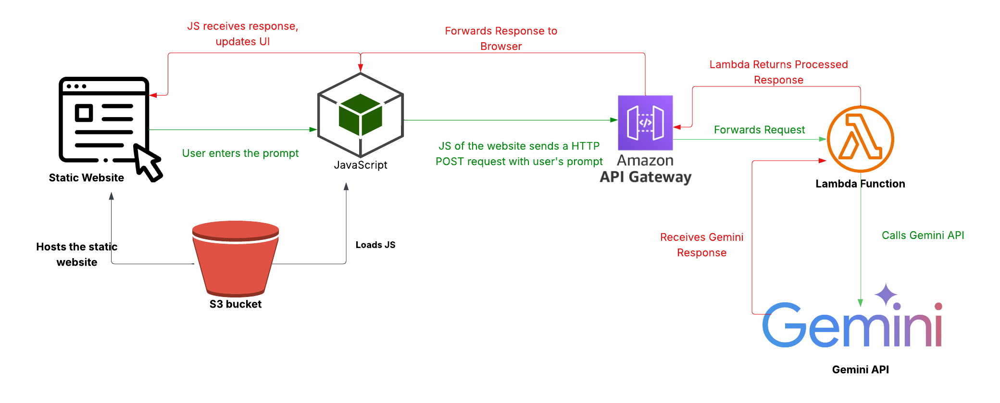

# google-flash-chatbot
Building a Serverless AI Chatbot with Gemini &amp; AWS
# Google Flash Chatbot: A Serverless AI Chatbot with Gemini & AWS


A real-time, serverless chatbot leveraging the power of Google's Gemini Pro LLM and a fully event-driven architecture on AWS. This project serves as a practical demonstration of building scalable, cost-effective, and modern AI applications in the cloud.


*(Optional: Create a simple GIF of your chatbot in action and place it in your repo as `demo.gif`)*

---

## Key Features

-   **Serverless Architecture:** No servers to manage, ensuring infinite scalability and a pay-as-you-go cost model.
-   **Real-Time Responses:** Event-driven design provides quick, conversational replies from the AI.
-   **Generative AI Core:** Utilizes Google's powerful Gemini model for intelligent and context-aware answers.
-   **Decoupled & Modular:** Each component is independent, making the system easy to maintain and upgrade.

---

## Architecture

The entire application runs on a serverless infrastructure, designed for efficiency and resilience.




### Components:

1.  **Amazon S3:** Hosts the static frontend (HTML, CSS, JavaScript) and serves it to the user's browser.
2.  **Amazon API Gateway:** Provides a secure RESTful API endpoint that acts as the "front door" for all user requests.
3.  **AWS Lambda:** The core of the backend logic. This Python function is triggered by API Gateway, processes the user's prompt, and communicates with the Gemini API.
4.  **Google Gemini API:** The powerful Large Language Model (LLM) that understands the prompt and generates the human-like response.

---

## Technology Stack

-   **AI Engine:** Google Gemini Pro
-   **Cloud Infrastructure (AWS):**
    -   AWS Lambda
    -   Amazon API Gateway
    -   Amazon S3
    -   AWS IAM (for secure permissions)
-   **Backend:** Python 3.9
-   **Frontend:** HTML5, CSS3, JavaScript (Fetch API)
-   **APIs:** REST

---

## How It Works: The Request Flow

1.  A user types a message into the static website hosted on **S3**.
2.  The browser's **JavaScript** sends an HTTP POST request with the prompt to the **API Gateway** endpoint.
3.  **API Gateway** receives the request and triggers the **AWS Lambda** function.
4.  The **Python** code in Lambda securely adds the Google API key and calls the **Google Gemini API**.
5.  Gemini processes the prompt and sends the AI-generated response back to Lambda.
6.  Lambda returns this response to API Gateway, which forwards it back to the user's browser.
7.  The JavaScript updates the UI to display the chatbot's answer.

---

## Setup & Deployment

To deploy this project, you will need an AWS account and a Google Cloud project with the Gemini API enabled.

### Prerequisites

-   AWS CLI configured with appropriate permissions.
-   A Google API Key for the Gemini API.
-   Python 3.9+ and `pip` installed.

### 1. Backend Deployment (Lambda & API Gateway)

1.  **Clone the repository:**
    ```bash
    git clone https://github.com/Pavan164-mlgoogle-flash-chatbo.git
    cd google-flash-chatbot/backend
    ```
2.  **Set up environment variables:**
    -   Store your Google API Key securely. It's recommended to use AWS Secrets Manager or Parameter Store and have the Lambda function fetch it. For a simple deployment, you can set it as an environment variable in the Lambda console.

3.  **Deploy the Lambda Function:**
    -   Create a new Lambda function in the AWS Console using the Python 3.9 runtime.
    -   Upload the `lambda_function.py` code.
    -   Set the `GOOGLE_API_KEY` environment variable.

4.  **Configure the API Gateway:**
    -   Create a new REST API in API Gateway.
    -   Create a `POST` method on a new resource (e.g., `/chat`).
    -   Integrate this method with your Lambda function.
    -   Deploy the API to a stage (e.g., `prod`) and note the **Invoke URL**.

### 2. Frontend Deployment (S3)

1.  **Update the API Endpoint:**
    -   Open the `frontend/script.js` file.
    -   Replace the placeholder `YOUR_API_GATEWAY_INVOKE_URL` with the URL you copied from API Gateway.

2.  **Upload to S3:**
    -   Create a new S3 bucket.
    -   In the "Properties" tab, enable "Static website hosting".
    -   Upload the `index.html`, `style.css`, and `script.js` files to the bucket.
    -   In the "Permissions" tab, ensure you have a bucket policy that allows public read access.

---

## Future Enhancements

-   **Conversation Memory:** Integrate DynamoDB to store chat history, allowing for context-aware, multi-turn conversations.
-   **Retrieval-Augmented Generation (RAG):** Use frameworks like LangChain and a vector database (e.g., ChromaDB, Pinecone) to allow the chatbot to answer questions based on private documents.
-   **User Authentication:** Implement Amazon Cognito to manage user sign-up and sign-in.
-   **CI/CD Pipeline:** Automate testing and deployment using GitHub Actions and AWS SAM/Terraform.
